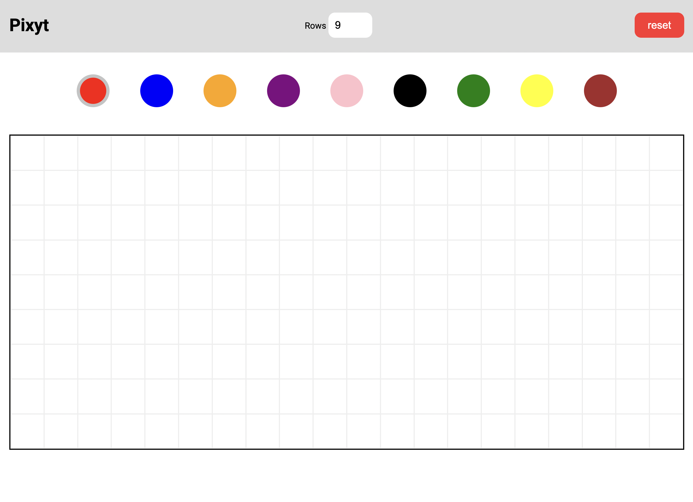

#Frontenders Community

## Challenge #8 - Pixit

In questa challenge dobbiamo creare un layout suddiviso in tre componenti: una navbar, una tavolozza di colori e una canvas.
La web app permette di scegliere un colore e di disegnare sulla canvas tenendo premuto il mouse.
Quando smettiamo di premere il mouse, smette di disegnare. Possiamo naturalmente cambiare colore più volte. 
Nella navbar è presente un input numerico per cambiare il numero di righe della canvas. 
E' presente inoltre un pulsante di reset che permette di ripristinare la canvas al punto di partenza.

### Bonus
Salvare la canvas come un'immagine

### Tecnologie
HTML
CSS: la webapp è stata realizzata, originariamente, con Tailwind. Questa versione è stata realizzata custom.
JS Plain / React / Vue / Svelte

### Preview

